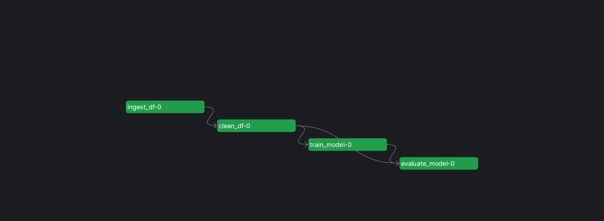

# End-to-End Electric-Range-Prediction MLOps Project -

 
 [](https://github.com/pre-commit/pre-commit) [](https://github.com/PyCQA/bandit) 
> ### The source code and some results of local and also cloud end-to-end implementation of MLOps in practice for an EV Range prediction project, including the source code of the application itself.

<p align="center">
  <a href="#about">About</a> •
  <a href="#installation">Installation</a> •
  <a href="#configuration">Configuration</a> •
  <a href="#how-to-use">How To Use</a> •
  <a href="#deploy-on-prefect-cloud">Deploy On Prefect Cloud</a>
</p>

## About
This project was created to predict the driving range of electric vehicles using machine learning. Knowing the approximate electric range for a vehicle's configuration can help guide purchase decisions and travel planning for EV owners.

The electric vehicle market has exploded in recent years as prices drop and ranges improve dramatically. Despite the increased adoption, range anxiety still prevents some consumers from purchasing their first EV. Models like this can allay those concerns by providing range estimates customized to the vehicle and driver.




## Installation
The source code was developed on Linus.
To set up this project locally, follow these steps:

1. Clone the repository
   ```bash
   git clone https://github.com/Dhrubaraj-Roy/end-to-end-electric-range-prediction.git
   ```

2. Navigate into the project directory
   ```bash
   cd ev-range-prediction
   ```

3. Create a virtual environment 
   ```bash
   python3 -m venv .venv
   ```

4. Activate the virtual environment
   ```bash
   # Linux/MacOS
   source .venv/bin/activate
   # Windows
   .venv\Scripts\activate
   ```

5. Install dependencies
   ```bash
   pip install -r requirements.txt
   ```

6. Make a copy of the example config
   ```bash 
   cp config/config.yaml.example config.yaml
   ```
  For more see the configuration section


7. Run the Prefect flow
   ```bash
   python3 flow.py
   ```

The main dependencies used are:

- Prefect
- Scikit-learn
- Pandas 
- CometML


## Configuration

The project utilizes CometML for experiment tracking and logging model metrics. The CometML configuration is specified in a `.comet.config` file:

```
[comet]
api_key = *******************
project_name = range-prediction
workspace = dhrubaraj-roy
```

The keys that can be set here are:

- **api_key**: Your private Comet ML API key for accessing the service.
- **project_name**: The name given to this group of experiments in CometML.
- **workspace**: Your CometML username or workspace the projects belong to.  

## How to Use

To run the electric vehicle range prediction workflow: 

1. Execute the Prefect flow by running `flow.py`:

   ```bash
   python3 flow.py
   ```
   This will:
   - Ingest the data
   - Clean and preprocess
   - Train a model
   - Evaluate model metrics

2. Monitor experiments in CometML dashboard:
   - Navigate to https://www.comet.ml and select your project
   - Analyze charts for RMSE, R^2 and other metrics
   - Compare runs and parameter configurations
   
   
3. Check Prefect dashboard:
   - Go to https://app.prefect.cloud/
   - View flow run details and execution logs
   - Check for errors or retry failed tasks
   
   - Flow run in Prefect 
   

4. Make predictions using Streamlit app:

   - Run `streamlit_app.py` 
     ```bash
   streamlit run streamlit_app.py
   ``` 
   - Input vehicle parameters 
   - View predicted range
   

This covers the end-to-end workflow from data ingestion to generating predictions for custom vehicles. Let me know if any integrations need more clarification! The core components like Prefect, CometML and Streamlit aim to make iterations and experiments simple.

Some key things that can be tweaked are model parameters, data preprocessing and ML pipeline steps. 
## Deploy on Prefect Cloud
To run the flow and model in production, we can deploy to Prefect Cloud.
  - For the deployment we need to build a deployment
  ```bash
  prefect deployment  build flow.py:my_flow -n range_prediction
   ``` 

   - And need to apply that and this will create a yaml file 
   ```bash
  prefect deployment apply my_flow-deployment.yaml
   ``` 

  - 
   ```bash
  prefect agent start -q 'default'
   ``` 
